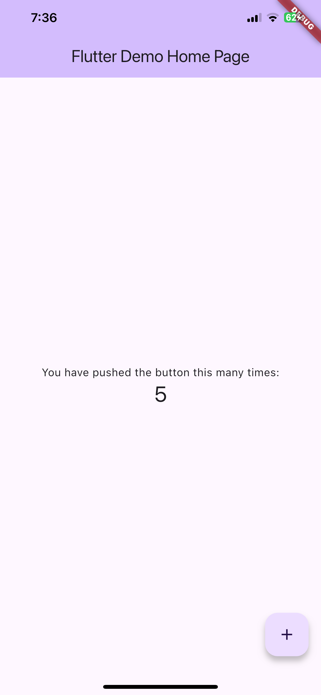

# flutter_flavor

[](https://pub.dev/packages/flutter_flavor)
[](https://opensource.org/licenses/MIT)

Flavors helps us to create builds for different instances of our app. For example, we can create a flavor for development, a flavor for production and another flavor for a demo of the app. In this way we can create different flavors, and thus have different instances of our apps before publishing it on the App Store and Google Play.

flutter_favor allows you to quickly configure and define dynamic variables for each flavor in your project. The `flavors`, as well as their names; they are dynamically defined by the developer or development team. In the configuration of a flavor you can set the `name` of each flavor, as well as the `color` and `location` of its banner. When attribute `name` is undefined or empty, the banner is hidden.

You can also configure the banners independently. The aforementioned attributes are globally configured in `FlavorConfig`, but can be changed in the `FlavorBanner`.

## Screenshot

|              PROD               |              DEV               |              TEST               |
| :-----------------------------: | :----------------------------: | :-----------------------------: |
|  |  |  |

**Note** By default the banner is shown in `BannerLocation.topStart` and is visibility only when the attribute `name` of configuration is defined and not empty.

## Getting Started

### Adding package

```yaml
flutter_flavor: ^3.0.4
```

### Importing package

```dart
import 'package:flutter_flavor/flutter_flavor.dart';
```

### Configuring

```dart
FlavorConfig(
    name: "DEVELOP",
    color: Colors.red,
    location: BannerLocation.bottomStart,
    variables: {
        "counter": 0,
        "baseUrl": "https://www.example.com",
    }
);
```

### Using variables

```dart
 int _counter = FlavorConfig.instance.variables["counter"];
```

## Example

```dart
import 'package:flutter/material.dart';

import 'package:flutter_flavor/flutter_flavor.dart';

void main() {
    FlavorConfig(
        name: "DEVELOP",
        color: Colors.red,
        location: BannerLocation.bottomStart,
        variables: {
            "counter": 5,
            "baseUrl": "https://www.example.com",
        },
    );
    return runApp(MyApp());
}

class MyApp extends StatelessWidget {
    @override
    Widget build(BuildContext context) {
        return FlavorBanner(
            color: Colors.blue,
            location: BannerLocation.topStart,
            child: MaterialApp(
                title: 'Flutter Demo',
                theme: ThemeData(
                    primarySwatch: Colors.blue,
                ),
                home: MyHomePage(title: 'Flutter Demo Home Page'),
            ),
        );
    }
}

class MyHomePage extends StatefulWidget {
    MyHomePage({Key key, this.title}) : super(key: key);

    final String title;

    @override
    _MyHomePageState createState() => _MyHomePageState();
}

class _MyHomePageState extends State<MyHomePage> {
    int _counter = FlavorConfig.instance.variables["counter"];

    void _incrementCounter() {
        setState(() {
            _counter++;
        });
    }

    @override
    Widget build(BuildContext context) {
        return Scaffold(
            appBar: AppBar(
                title: Text(widget.title),
            ),
            body: Center(
                child: Column(
                    mainAxisAlignment: MainAxisAlignment.center,
                    children: <Widget>[
                        Text(
                            'You have pushed the button this many times:',
                        ),
                        Text(
                            '$_counter',
                            style: Theme
                                    .of(context)
                                    .textTheme
                                    .display1,
                        ),
                    ],
                ),
            ),
            floatingActionButton: FloatingActionButton(
                onPressed: _incrementCounter,
                tooltip: 'Increment',
                child: Icon(Icons.add),
            ),
        );
    }
}
```

## Support native flavors settings (For now only on Android)

### Setting

```yaml
flutter_flavor:
  dimensions:
    android: "flutter-flavor"

  flavors:
    dev:
      android:
        name: "Dev App"
        applicationId: "com.example.dev"
        googleAdsId: "ca-app-pub-1234567890123456~1234567890"

    prod:
      app:
        name: "Prod App"
        id: "com.example.prod"
      android:
        googleAdsId: "ca-app-pub-1234567890123456~1234567890"
```

### Generating flavors

```json
flutter pub run flutter_flavor:main
```

### Run flavor

```
flutter run --flavor <flavor> -t lib/main-<flavor>.dart
```

### Example

```
flutter run --flavor dev -t lib/main-dev.dart
```

```
flutter run --flavor prod -t lib/main.dart
```

## VSCode Configuration

The .vscode folder is created in the workspace, if it does not exist it can be created by hand. Inside that folder a launch.json file is created and the configuration is established inside the file. For more information, visit: https://code.visualstudio.com/docs/editor/debugging and https://go.microsoft.com/fwlink/?linkid=830387

```json
{
  "version": "0.2.0",
  "configurations": [
    {
      "name": "PROD-Flavor",
      "program": "[project-folder]/lib/main_prod.dart",
      "request": "launch",
      "type": "dart"
    },
    {
      "name": "DEV-Flavor",
      "program": "[project-folder]/lib/main_dev.dart",
      "request": "launch",
      "type": "dart"
    }
  ]
}
```

## Donation (Bitcoin)

I work on this project in my little free time because my personal life and my work occupy me a lot of time. But you can push me to work more on this project if you invite me to coffe.


`bc1qgvpj768nrym9rclycc5n92g87z6utwkh5j5x8j`

## License

    MIT License
