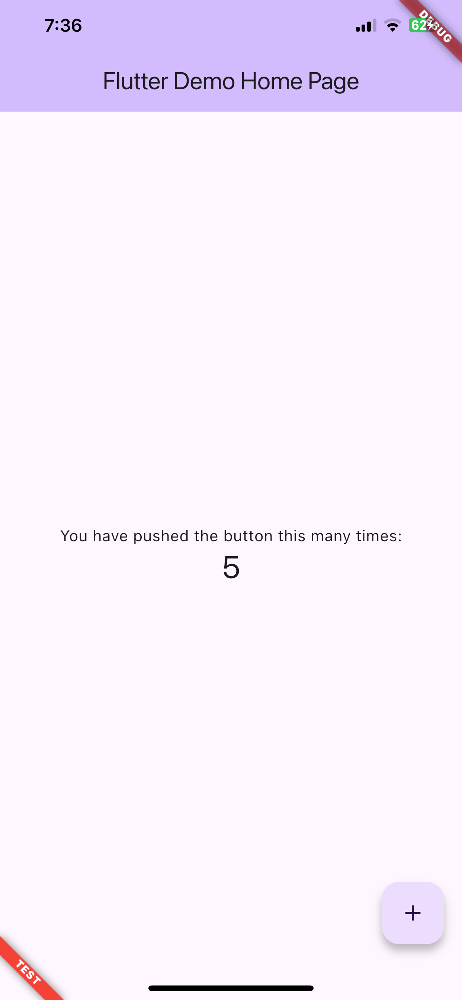

# flutter_flavor

[](https://pub.dartlang.org/packages/flutter_flavor)
[](https://github.com/lrferreiro/flutter_flavor)
[](https://opensource.org/licenses/MIT)

flutter_favor allows you a quick configuration and definition of dynamic variables for each flavor of your project. flutter_favor has 3 basic flavors defined: PROD, DEV and TEST. You can also change the name of the flavor, the color and its location in your configuration.

## Screenshot

|              PROD               |              DEV               |              TEST               |
| :-----------------------------: | :----------------------------: | :-----------------------------: |
|  |  |  |

**Note** By default the banner is shown in `BannerLocation.topStart` and in the `PROD` environment don't showed.

## Getting Started

### Adding package

```yaml
flutter_flavor: ^1.0.1+2
```

### Importing package

```yaml
import 'package:flutter_flavor/flutter_flavor.dart';
```

### Configuring

```dart
FlavorConfig(
    environment: FlavorEnvironment.DEV,
    name: "DEVEL",
    color: Colors.red,
    location: BannerLocation.bottomStart,
    variables: {
        "counter": 0,
        "baseUrl": "https://www.example.com",
    }
);
```

### Using variables

```dart
 int _counter = FlavorConfig.instance.variables["counter"];
```

## Example

```dart
import 'package:flutter/material.dart';

import 'package:flutter_flavor/flutter_flavor.dart';

void main() {
    FlavorConfig(
            environment: FlavorEnvironment.DEV,
            name: "DEVEL",
            color: Colors.red,
            location: BannerLocation.bottomStart,
            variables: {
                "counter": 5,
                "baseUrl": "https://www.example.com",
            });
    return runApp(MyApp());
}

class MyApp extends StatelessWidget {
    @override
    Widget build(BuildContext context) {
        return FlavorBanner(
            child: MaterialApp(
                title: 'Flutter Demo',
                theme: ThemeData(
                    primarySwatch: Colors.blue,
                ),
                home: MyHomePage(title: 'Flutter Demo Home Page'),
            ),
        );
    }
}

class MyHomePage extends StatefulWidget {
    MyHomePage({Key key, this.title}) : super(key: key);

    final String title;

    @override
    _MyHomePageState createState() => _MyHomePageState();
}

class _MyHomePageState extends State<MyHomePage> {
    int _counter = FlavorConfig.instance.variables["counter"];

    void _incrementCounter() {
        setState(() {
            _counter++;
        });
    }

    @override
    Widget build(BuildContext context) {
        return Scaffold(
            appBar: AppBar(
                title: Text(widget.title),
            ),
            body: Center(
                child: Column(
                    mainAxisAlignment: MainAxisAlignment.center,
                    children: <Widget>[
                        Text(
                            'You have pushed the button this many times:',
                        ),
                        Text(
                            '$_counter',
                            style: Theme
                                    .of(context)
                                    .textTheme
                                    .display1,
                        ),
                    ],
                ),
            ),
            floatingActionButton: FloatingActionButton(
                onPressed: _incrementCounter,
                tooltip: 'Increment',
                child: Icon(Icons.add),
            ),
        );
    }
}
```

## VSCode Configuration

The .vscode folder is created in the workspace, if it does not exist it can be created by hand. Inside that folder a launch.json file is created and the configuration is established inside the file. For more information, visit: https://code.visualstudio.com/docs/editor/debugging and https://go.microsoft.com/fwlink/?linkid=830387

```json
{
  "version": "0.2.0",
  "configurations": [
    {
      "name": "PROD-Flavor",
      "program": "[project-folder]/lib/main_prod.dart",
      "request": "launch",
      "type": "dart"
    },
    {
      "name": "DEV-Flavor",
      "program": "[project-folder]/lib/main_dev.dart",
      "request": "launch",
      "type": "dart"
    }
  ]
}
```

## License

    MIT License
